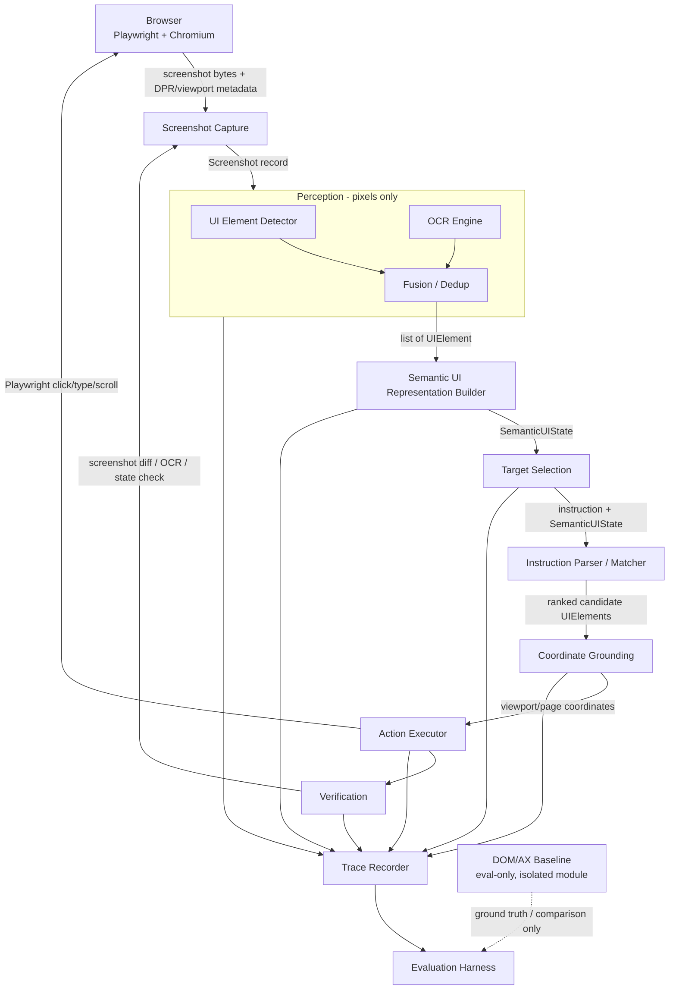

# VisiPilot

On-device visual perception and grounding for lightweight browser agents — built to act on **pixels**, not the DOM.

## Problem statement

Most browser-automation "agents" cheat: they read the DOM or accessibility tree to find elements, then merely render a screenshot for the human. That's brittle in the real world (obfuscated/dynamic DOMs, canvas-rendered UI, cross-origin iframes, anti-automation markup) and it doesn't transfer to non-browser targets (desktop apps, remote screens).

VisiPilot instead asks: given only a screenshot and a natural-language instruction, can a small, local model stack reliably find the right UI element, click it, type into it, and verify the result — the way a human looking at the screen would — while running comfortably on a consumer laptop GPU?

Given an instruction such as:

> "Find the search box, type Python, and click Search."

the system performs:

```
Browser → Screenshot → Perception → Semantic UI Representation → Target Selection → Coordinate Grounding → Action → Verification
```

DOM/accessibility data is used **only** to generate ground-truth labels for evaluation and as an explicitly separate baseline for comparison — never at runtime to find targets. See `Instructions.md` for the full pixels-first rule and the rest of the project's binding constraints.

## Hardware assumptions

| Resource | Spec (verified on target machine) |
|---|---|
| OS | Windows 11 Home Single Language, build 26200 |
| CPU | Intel Core Ultra 7 255HX, 20 logical processors |
| RAM | 16 GB installed, ~15.4 GB usable |
| GPU | NVIDIA GeForce RTX 5060 Laptop GPU, 8 GB VRAM (8151 MiB), Blackwell architecture, compute capability sm_120 (12.0) |
| GPU driver | 595.79, CUDA 13.2 (per `nvidia-smi`) |
| Disk | 3 volumes, hundreds of GB free |

**Inference budget:** ≤ ~6 GB VRAM peak for the whole loaded pipeline, leaving headroom for Chromium/Edge and the OS. This is a hard constraint driving every model-selection decision — see `Instructions.md` §3.

Blackwell is a recent architecture; stable-release CUDA/PyTorch/ONNX Runtime support is still maturing as of late 2026 (see the open tracking issue [pytorch/pytorch#164342](https://github.com/pytorch/pytorch/issues/164342)). Every runtime choice in this project is verified against this hardware, not assumed.

## Architecture

Modular monolith: one Python process, strict typed interfaces between stages, each stage independently replaceable. No microservices.



### Module boundaries

- **Screenshot Capture** — Playwright-driven; owns viewport size, `deviceScaleFactor`, and browser zoom configuration; produces a `Screenshot` record (image bytes + explicit coordinate-space metadata). No perception logic here.
- **Perception** — UI element detector + OCR, operating strictly on the `Screenshot` image. Never imports browser/DOM access. Produces raw `UIElement` candidates with `source` tags (`detector` / `ocr`).
- **Semantic UI Representation Builder** — fuses detector + OCR output into deduplicated `UIElement`s with `relations` (nearby, label-of, contained-in) and `semantic_role` inference. Produces a `SemanticUIState`.
- **Target Selection** — takes the user instruction + `SemanticUIState`, returns ranked candidate elements. Pure reasoning over the structured representation, never over raw pixels or the DOM.
- **Coordinate Grounding** — deterministic mapping from a selected `UIElement`'s bbox (screenshot-pixel space) to viewport/page coordinates Playwright can act on, accounting for DPR, zoom, and scroll offset.
- **Action Executor** — issues the actual Playwright action (click/type/scroll) using trusted input events.
- **Verification** — confirms the action had the expected effect via visual/OCR/state diffing (pixels-first) — never via DOM in the runtime path.
- **Trace Recorder** — cross-cutting; every stage writes a structured trace record (see `Instructions.md`/implementation plan) for debugging and evaluation.
- **DOM/AX Baseline & Evaluation Harness** — explicitly isolated, imported only by evaluation code, never by the runtime pipeline. Used for ground-truth labeling and for a labeled "DOM/AX baseline" comparison run.

Full typed schema for `UIElement`/`SemanticUIState` and the per-step trace record lives in `implementation-plan.md` (defined before implementation begins, per the architecture phase).

## Setup plan (Windows)

Implemented so far:

1. Python 3.12 virtual environment: `py -3.12 -m venv .venv` — 3.12 chosen over the also-installed 3.14 for broader ML-library wheel availability.
2. **Install order matters** for the perception dependencies — install in this exact sequence, or `pip` will silently downgrade the GPU-enabled torch to a CPU-only build:
   ```
   pip install pydantic pytest playwright
   pip install torch --index-url https://download.pytorch.org/whl/cu128
   pip install torchvision --index-url https://download.pytorch.org/whl/cu128 --no-deps
   pip install transformers
   pip install easyocr --no-deps
   pip install opencv-python-headless scipy numpy Pillow scikit-image python-bidi PyYAML Shapely pyclipper ninja
   ```
   This was discovered the hard way: a plain `pip install transformers easyocr` resolves `easyocr`'s dependency on `torch`/`torchvision` against plain PyPI (not the cu128 index), which pulls a CPU-only `torch-2.14.0` and would have silently replaced the verified Blackwell GPU build. See `requirements.txt` for the full pinned/annotated list.
3. Playwright is configured to drive the **already-installed system Chrome** via `channel="chrome"` (see `visipilot/capture/screenshot.py::launch_page`), rather than downloading Playwright's own bundled Chromium — this avoids an extra large download after Phase 0 already hit real download instability in this environment, and Chrome 152 is already verified present.
4. `pytest` from the repo root runs the full suite (42 tests as of this writing, unit + integration against a real local Chrome instance and real OWLv2/EasyOCR inference).

Not yet implemented:

5. Grounding VLM / reasoning LLM dependencies, once that milestone starts.
6. `uv` and `conda` are not currently installed on the target machine; `pip` + `venv` remains the working path.

## Goals

- Demonstrate a working pixels-first perception → grounding → action → verification loop for browser UI tasks.
- Keep the entire local inference pipeline within ≤6 GB VRAM peak on an 8 GB Blackwell GPU.
- Produce measurable, reproducible grounding/task-success numbers, benchmarked against a DOM/AX baseline.
- Keep the system modular enough that any single stage (detector, OCR, grounding model, reasoning LLM) can be swapped without touching the rest.

## Current status

Phase 0 (environment/technology verification) is complete, including a real GPU smoke test (PyTorch 2.11.0+cu128, `torch.cuda.is_available()` → `True`, RTX 5060 Laptop GPU, compute capability sm_120 confirmed).

Phase A is underway. Implemented and verified so far:
- `visipilot/types.py` — the `Screenshot`/`UIElement`/`SemanticUIState` typed schema.
- `visipilot/grounding/coordinates.py` — deterministic screenshot-px ↔ viewport-CSS ↔ page-CSS coordinate mapping, unit-tested across DPR (1.0/1.25/1.5/2.0), zoom, and scroll offset, and additionally verified against a real browser's DOM ground truth at three DPR values.
- `visipilot/capture/screenshot.py` — Playwright-driven screenshot capture with explicit coordinate-space metadata.
- `visipilot/eval/dom_ground_truth.py` — the isolated, eval-only DOM ground-truth extractor.
- `visipilot/testserver.py` + `testpages/search_basic.html` — the controlled local test page and server.
- `visipilot/perception/detector.py` — OWLv2 zero-shot UI element detector (Apache 2.0, chosen over OmniParser's AGPL-3.0 `icon_detect`).
- `visipilot/perception/ocr.py` — EasyOCR text extraction (Apache 2.0, PyTorch-native, reuses the verified CUDA stack).
- `visipilot/perception/fusion.py` — merges detector + OCR output into deduplicated `UIElement`s.
- `visipilot/semantic/` — the Semantic UI Representation Builder: relation inference (`relations.py`), semantic role inference (`semantic_role.py`), and `builder.py::build_semantic_state()` tying them together.
- `visipilot/target_selection/` — instruction parsing (`instruction_parser.py`, rule-based FIND/TYPE/CLICK clause splitting) and the matcher (`matcher.py::match_target()`, text + relation + structural scoring).
- 74/74 tests passing (`pytest`), including live integration tests against real OWLv2/EasyOCR inference and, new this milestone, the full perception → semantic representation → target selection chain scored against real DOM ground truth. Combined detector+OCR peak VRAM measured at **1.71 GB**, comfortably within the ≤6 GB budget.
- Honest findings worth flagging (measured, not smoothed over): OWLv2's zero-shot type classification is weak on this flat synthetic test page (never distinguished "button" from "text input"). Real integration testing this milestone also caught a genuine matcher bug (a distractor paragraph's incidental text overlap out-scored the real search input — now fixed with a length-based heuristic and a regression test) and surfaced one honest, unresolved ambiguity (the real input and the real button tie on text alone, given weak detector types and an OCR misread) — the matcher correctly surfaces both as candidates rather than guessing, per the project's failure-handling rules.

Not yet implemented: action execution, verification, and tracing — see `implementation-plan.md` Phase A for the remaining checklist.

## Evaluation strategy

Two tracks, always clearly labeled and never mixed:

1. **Pixel-based system performance** — the actual VisiPilot pipeline, using only screenshots at runtime. Measured on controlled local test pages (with DOM-derived ground truth used *only* to score results, not to run them) and, licensing permitting, on public GUI-grounding benchmarks (ScreenSpot / ScreenSpot-v2 / ScreenSpot-Pro, Mind2Web).
2. **DOM/AX baseline performance** — a separate, explicitly labeled module that finds targets via the DOM/accessibility tree, run over the same tasks for comparison. Never used in the runtime action path.

Metrics tracked for both: click accuracy, bounding-box IoU, element identification accuracy, task success rate, verification accuracy, latency, peak VRAM, peak RAM, and model size. See `TESTING.md` for the current (mostly not-yet-started) tracker and `implementation-plan.md` for exit criteria per phase.
