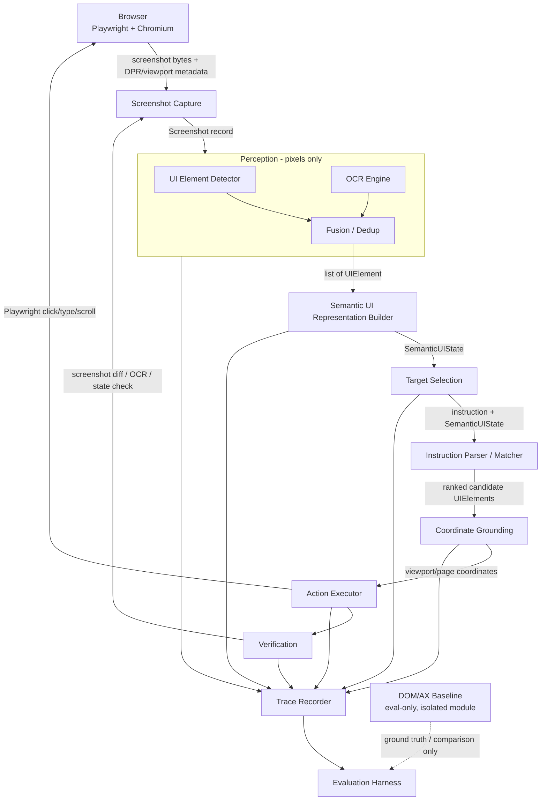

# VisiPilot

On-device visual perception and grounding for lightweight browser agents — built to act on **pixels**, not the DOM.

## Problem statement

Most browser-automation "agents" cheat: they read the DOM or accessibility tree to find elements, then merely render a screenshot for the human. That's brittle in the real world (obfuscated/dynamic DOMs, canvas-rendered UI, cross-origin iframes, anti-automation markup) and it doesn't transfer to non-browser targets (desktop apps, remote screens).

VisiPilot instead asks: given only a screenshot and a natural-language instruction, can a small, local model stack reliably find the right UI element, click it, type into it, and verify the result — the way a human looking at the screen would — while running comfortably on a consumer laptop GPU?

Given an instruction such as:

> "Find the search box, type Python, and click Search."

the system performs:

```
Browser → Screenshot → Perception → Semantic UI Representation → Target Selection → Coordinate Grounding → Action → Verification
```

DOM/accessibility data is used **only** to generate ground-truth labels for evaluation and as an explicitly separate baseline for comparison — never at runtime to find targets. See `Instructions.md` for the full pixels-first rule and the rest of the project's binding constraints.

## Hardware assumptions

| Resource | Spec (verified on target machine) |
|---|---|
| OS | Windows 11 Home Single Language, build 26200 |
| CPU | Intel Core Ultra 7 255HX, 20 logical processors |
| RAM | 16 GB installed, ~15.4 GB usable |
| GPU | NVIDIA GeForce RTX 5060 Laptop GPU, 8 GB VRAM (8151 MiB), Blackwell architecture, compute capability sm_120 (12.0) |
| GPU driver | 595.79, CUDA 13.2 (per `nvidia-smi`) |
| Disk | 3 volumes, hundreds of GB free |

**Inference budget:** ≤ ~6 GB VRAM peak for the whole loaded pipeline, leaving headroom for Chromium/Edge and the OS. This is a hard constraint driving every model-selection decision — see `Instructions.md` §3.

Blackwell is a recent architecture; stable-release CUDA/PyTorch/ONNX Runtime support is still maturing as of late 2026 (see the open tracking issue [pytorch/pytorch#164342](https://github.com/pytorch/pytorch/issues/164342)). Every runtime choice in this project is verified against this hardware, not assumed.

## Architecture

Modular monolith: one Python process, strict typed interfaces between stages, each stage independently replaceable. No microservices.



### Module boundaries

- **Screenshot Capture** — Playwright-driven; owns viewport size, `deviceScaleFactor`, and browser zoom configuration; produces a `Screenshot` record (image bytes + explicit coordinate-space metadata). No perception logic here.
- **Perception** — UI element detector + OCR, operating strictly on the `Screenshot` image. Never imports browser/DOM access. Produces raw `UIElement` candidates with `source` tags (`detector` / `ocr`).
- **Semantic UI Representation Builder** — fuses detector + OCR output into deduplicated `UIElement`s with `relations` (nearby, label-of, contained-in) and `semantic_role` inference. Produces a `SemanticUIState`.
- **Target Selection** — takes the user instruction + `SemanticUIState`, returns ranked candidate elements. Pure reasoning over the structured representation, never over raw pixels or the DOM.
- **Coordinate Grounding** — deterministic mapping from a selected `UIElement`'s bbox (screenshot-pixel space) to viewport/page coordinates Playwright can act on, accounting for DPR, zoom, and scroll offset.
- **Action Executor** — issues the actual Playwright action (click/type/scroll) using trusted input events.
- **Verification** — confirms the action had the expected effect via visual/OCR/state diffing (pixels-first) — never via DOM in the runtime path.
- **Trace Recorder** — cross-cutting; every stage writes a structured trace record (see `Instructions.md`/implementation plan) for debugging and evaluation.
- **DOM/AX Baseline & Evaluation Harness** — explicitly isolated, imported only by evaluation code, never by the runtime pipeline. Used for ground-truth labeling and for a labeled "DOM/AX baseline" comparison run.

Full typed schema for `UIElement`/`SemanticUIState` and the per-step trace record lives in `implementation-plan.md` (defined before implementation begins, per the architecture phase).

## Setup plan (Windows)

Not yet implemented — this is the planned setup sequence, to be executed starting in Phase A of `implementation-plan.md`:

1. Python 3.12 virtual environment (`py -3.12 -m venv .venv`) — 3.12 chosen over the also-installed 3.14 for broader ML-library wheel availability.
2. Install PyTorch with a CUDA 12.8+ build verified against this machine's Blackwell GPU via an actual smoke test (not assumed) — see GPU smoke test results below.
3. Install Playwright (`pip install playwright && playwright install chromium msedge`).
4. Install perception dependencies pinned to specific versions (OCR engine, detector, grounding model) once selected per the technology evaluation.
5. Pin all dependency versions in `requirements.txt` / `pyproject.toml`; record exact model checkpoint hashes where practical.
6. `uv` and `conda` are not currently installed on the target machine; `pip` + `venv` is the default path unless a specific need for `uv` emerges (faster installs) — to be revisited.

## Goals

- Demonstrate a working pixels-first perception → grounding → action → verification loop for browser UI tasks.
- Keep the entire local inference pipeline within ≤6 GB VRAM peak on an 8 GB Blackwell GPU.
- Produce measurable, reproducible grounding/task-success numbers, benchmarked against a DOM/AX baseline.
- Keep the system modular enough that any single stage (detector, OCR, grounding model, reasoning LLM) can be swapped without touching the rest.

## Current status

Documentation and environment-verification phase. No pipeline code has been implemented yet (see `implementation-plan.md`). Environment inspection and technology research are complete; hardware compatibility (GPU smoke test) is being verified empirically before any model is adopted.

## Evaluation strategy

Two tracks, always clearly labeled and never mixed:

1. **Pixel-based system performance** — the actual VisiPilot pipeline, using only screenshots at runtime. Measured on controlled local test pages (with DOM-derived ground truth used *only* to score results, not to run them) and, licensing permitting, on public GUI-grounding benchmarks (ScreenSpot / ScreenSpot-v2 / ScreenSpot-Pro, Mind2Web).
2. **DOM/AX baseline performance** — a separate, explicitly labeled module that finds targets via the DOM/accessibility tree, run over the same tasks for comparison. Never used in the runtime action path.

Metrics tracked for both: click accuracy, bounding-box IoU, element identification accuracy, task success rate, verification accuracy, latency, peak VRAM, peak RAM, and model size. See `TESTING.md` for the current (mostly not-yet-started) tracker and `implementation-plan.md` for exit criteria per phase.
